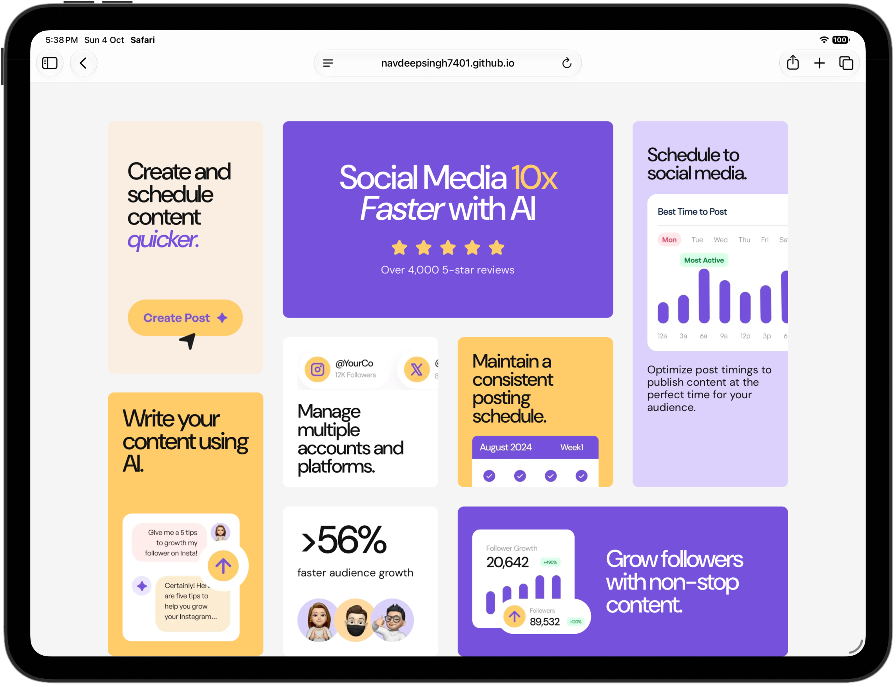

# Bento Grid — Social Media Dashboard

A responsive bento-grid landing page for a social media management service. The layout is based on the supplied desktop and mobile design references and uses the project's included illustrations and DM Sans font files.

[View the live project](https://navdeepsingh7401.github.io/bento-grid/)



## Features

- Responsive desktop, tablet, and mobile layouts
- CSS Grid layout that rearranges into a single-column mobile view
- Locally hosted DM Sans variable fonts
- Included illustrations with descriptive alternative text
- No JavaScript, package installation, or build step required

## Getting started

Open `index.html` in a browser to view the page. Alternatively, run a local static server from the project directory:

```sh
python3 -m http.server 8000
```

Then visit [http://localhost:8000](http://localhost:8000).

## Project structure

```text
.
├── assets/
│   ├── fonts/          # DM Sans font files
│   └── images/         # Page illustrations and favicon
├── design/             # Desktop and mobile design references
├── index.html          # Page content and structure
├── style.css           # Layout, typography, and responsive styles
└── preview.jpg         # Project preview
```

## Responsive behavior

The page uses a four-column grid on wide screens, switches to a two-column layout on tablet-sized screens, and stacks its cards in one column on mobile. The mobile layout is tuned for the 375px reference and remains usable down to 320px wide.

## Built with

- Semantic HTML
- CSS Grid and Flexbox
- DM Sans
- WebP illustrations

## Design references

- Desktop: [`design/desktop-design.jpg`](./design/desktop-design.jpg)
- Mobile: [`design/mobile-design.jpg`](./design/mobile-design.jpg)

This project was created from a [Frontend Mentor](https://www.frontendmentor.io/) Bento grid challenge.
